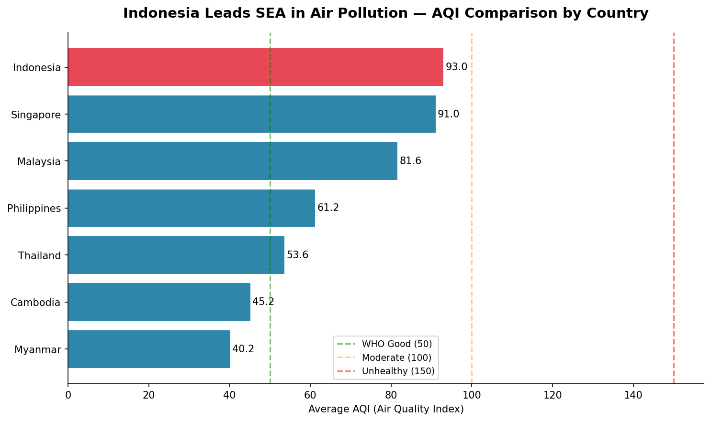
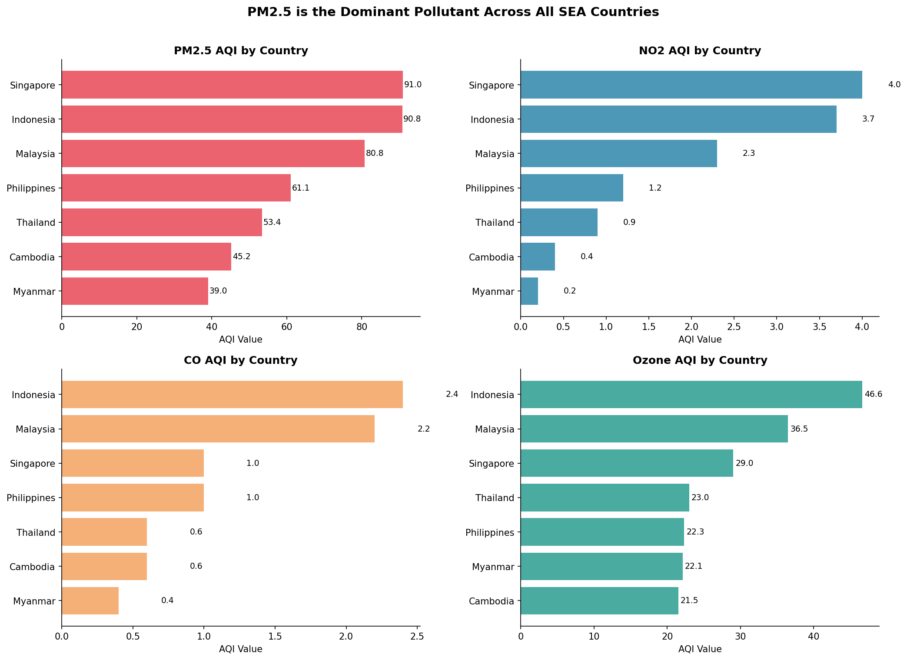
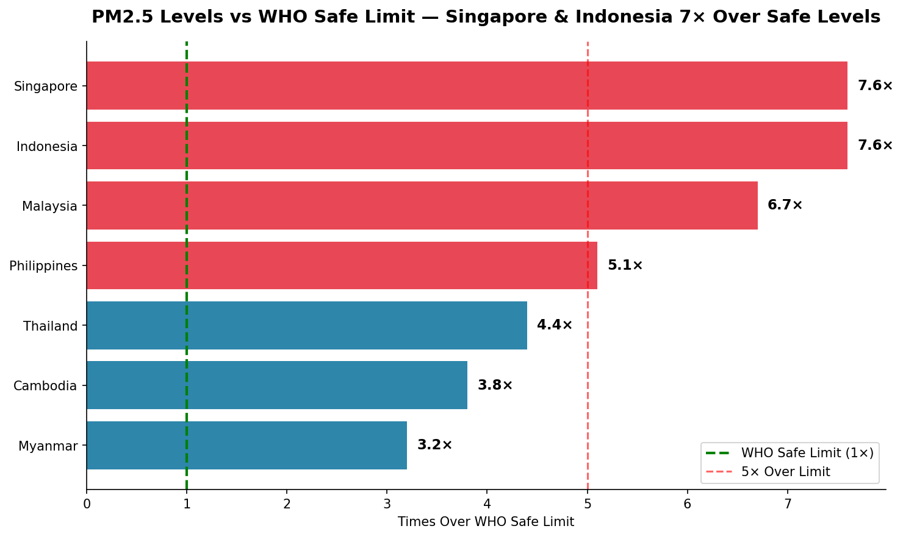
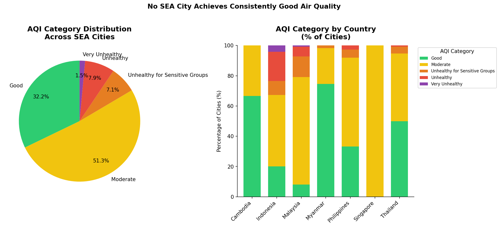

# Air Quality Analysis — Southeast Asia
### PM2.5 Crisis Across 7 SEA Countries — Data-Driven Policy Insights


---

## Overview

Air pollution is one of the most pressing public health crises in Southeast Asia. According to IQAir (2024), Indonesia is the most polluted country in SEA, with PM2.5 levels averaging 35.5 µg/m³ — 10× higher than WHO safe limits. South Tangerang ranked as the most polluted city in all of ASEAN.

I grew up in Medan, one of Indonesia's most polluted cities, so this dataset is not abstract to me. This analysis examines air quality across 7 SEA countries and 1,159 cities to understand where the problem is worst, what is driving it, and what the data suggests about solutions.

Four questions guide this analysis:
- Which SEA countries have the worst air quality?
- Which pollutants are most dangerous across the region?
- How do SEA countries compare against WHO safety standards?
- Where are the pollution hotspots geographically?

---

## Key Findings

| Country | Avg AQI | PM2.5 vs WHO Limit |
|---|---|---|
| Indonesia | 93.0 | 7.6× over limit |
| Singapore | 91.0 | 7.6× over limit |
| Malaysia | 81.6 | 6.7× over limit |
| Philippines | 61.2 | 5.1× over limit |
| Thailand | 53.6 | 4.4× over limit |
| Cambodia | 45.2 | 3.8× over limit |
| Myanmar | 40.2 | 3.2× over limit |

Not a single SEA country meets WHO PM2.5 safe limits. Even Myanmar — the least polluted country in this dataset — exceeds safe levels by 3.2×. 67.8% of all SEA cities in this dataset operate above the WHO AQI threshold of 50.

---

## Analysis & Visualizations

### 1. AQI Comparison by Country



Indonesia leads SEA with an average AQI of 93.0, followed surprisingly by Singapore at 91.0. Singapore's high AQI — counterintuitive for a well-governed city-state with strict environmental regulations — is driven by transboundary haze from Indonesian forest fires rather than domestic industrial activity. The 2.3× gap between Indonesia and Myanmar highlights how uneven industrial development is across the region.

---

### 2. Pollutant Breakdown by Country



PM2.5 is the dominant pollutant across all SEA countries, with Singapore (91.0) and Indonesia (90.8) nearly tied at the top. Ozone is the secondary concern — Indonesia leads at 46.6, nearly double Cambodia's 21.5. CO and NO2 remain at comparatively manageable levels across the region, confirming that particulate matter should be the primary intervention target.

---

### 3. PM2.5 vs WHO Safe Limits



Four out of seven SEA countries exceed the 5× danger threshold for PM2.5. Singapore and Indonesia are tied at 7.6× over WHO limits — a finding that reframes Singapore's air quality problem as a regional transboundary issue rather than a domestic one. Myanmar's relatively low ratio (3.2×) should be read carefully: it likely reflects fewer monitoring stations rather than genuinely cleaner air.

---

### 4. AQI Category Distribution



Only 32.2% of SEA cities achieve "Good" air quality, while 51.3% sit in "Moderate" and 16.5% fall in "Unhealthy" or worse. Malaysia has nearly 0% "Good" cities. Singapore's 100% "Moderate-or-worse" profile — despite its domestic environmental policies — points directly to uncontrollable transboundary haze as an external factor.

---

### 5. Interactive Pollution Map

****[View Interactive Map](https://devipanjaitan.github.io/sea-air-quality-analysis/images/sea_pollution_map.html)**** — click any city marker for AQI details.

The map reveals a clear pollution concentration across Java island. Jakarta (AQI 197) and Bandung (198) are the most polluted mapped cities, both approaching the "Very Unhealthy" threshold and serving tens of millions of residents. In contrast, Chiang Mai (20) and Phuket (43) in Thailand achieve "Good" AQI — showing that national averages can mask dramatic local variation within the same country.

---

## Recommendations

**Prioritize Java's pollution corridor.** Jakarta (AQI 197) and Bandung (198) are the two most polluted cities in this dataset, both just below "Very Unhealthy" classification. A targeted industrial emission audit across the Jakarta–Bandung–Surabaya corridor would have the highest impact per intervention in the entire region. Real-time AQI monitoring and public alert systems should be mandatory in all cities with AQI above 150.

**Address transboundary haze at the ASEAN level.** Singapore's PM2.5 is 7.6× over WHO limits despite strict domestic regulations — identical to Indonesia. This is only explainable by transboundary haze from Sumatra and Borneo forest fires. The existing ASEAN Agreement on Transboundary Haze Pollution exists but lacks enforcement; strengthening it is the single policy change that would benefit the most countries simultaneously. A shared real-time satellite monitoring dashboard accessible to all SEA governments would enable faster coordinated response.

**Build public early warning infrastructure.** 67.8% of SEA cities exceed the WHO AQI threshold of 50, yet most residents have no formal alert system. Integrating AQI warnings into existing national weather apps is low-cost and high-reach. Schools and outdoor workplaces should have defined protocols — not just recommendations — when AQI exceeds 150.

---

## Project Structure

```
sea-air-quality-analysis/
├── README.md
├── air_quality_analysis.ipynb
├── data/
│   └── global air pollution dataset.csv
└── images/
    ├── 01_aqi_by_country.png
    ├── 02_pollutants_by_country.png
    ├── 03_who_comparison.png
    ├── 04_aqi_category.png
    └── sea_pollution_map.html
```

---

## How to Run

```bash
# Clone this repository
git clone https://github.com/devipanjaitan/sea-air-quality-analysis.git
cd sea-air-quality-analysis

# Create virtual environment
python -m venv .venv
source .venv/bin/activate

# Install dependencies
pip install pandas numpy matplotlib seaborn folium jupyter ipykernel

# Download dataset from Kaggle
# https://www.kaggle.com/datasets/hasibalmuzdadid/global-air-pollution-dataset
# Place CSV inside the /data folder

# Open notebook in VS Code
```

---

## Dataset

- **Source:** [Global Air Pollution Dataset](https://www.kaggle.com/datasets/hasibalmuzdadid/global-air-pollution-dataset) via Kaggle
- **Size:** 23,463 rows × 12 columns — 1,159 SEA cities after filtering
- **Coverage:** Indonesia, Singapore, Malaysia, Philippines, Thailand, Cambodia, Myanmar
- **Pollutants:** AQI, PM2.5, NO2, CO, Ozone

---

## Related Projects

- [Project 1 — E-Commerce EDA & Consumer Behavior](https://github.com/devipanjaitan/olist-ecommerce-analysis)
- [Project 2 — SQL Sales Performance Analysis](https://github.com/devipanjaitan/olist-sql-analysis)
- [Project 3 — Customer Churn Prediction (ML + SHAP)](https://github.com/devipanjaitan/customer-churn-prediction)

---

## Author

**Devi Silvia Panjaitan**
- [LinkedIn](https://linkedin.com/in/devipanjaitan)
- [GitHub](https://github.com/devipanjaitan)
